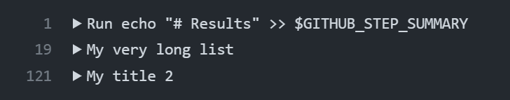
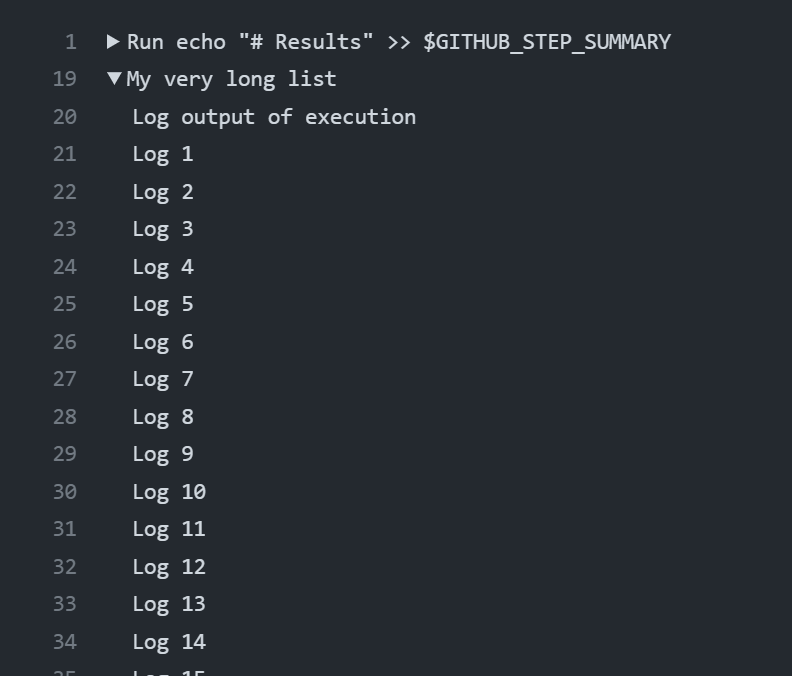
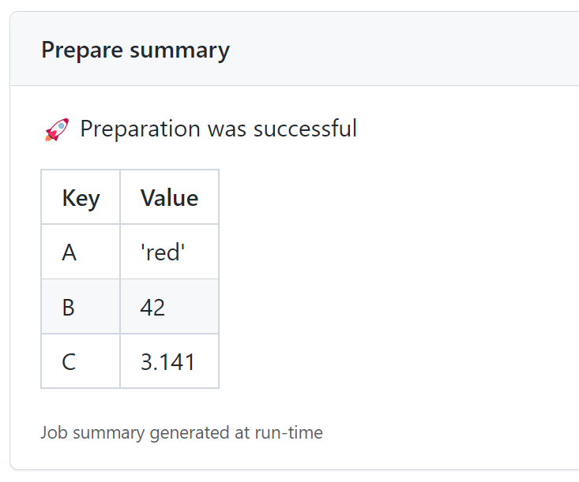
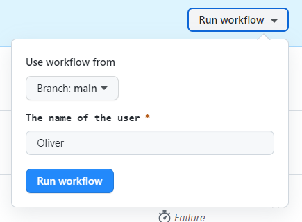

# GitHub Actions Samples

My samples about GitHub Actions that I learned in multiple customer projects.

You can find the official documentation on GitHub Actions here: <https://docs.github.com/en/actions/learn-github-actions>

## Introduction

I'm a big fan of GitHub Actions because they are easy to develop and helps very much in automation almost everything.

## My Tipps & Tricks

### 1. Generate better outputs in logs

Some bash scripts can generate a lot of valuable output, or a loooooong list to scroll down to find the right information.

```yaml
steps:
      - shell: bash
        run: |
          echo "# Results" >> $GITHUB_STEP_SUMMARY

          echo "::group::My very long list"
          echo "Log output of execution"
          for i in {1..100}
          do
            echo "Log $i"
          done
          echo "::endgroup::"

          echo "::group::My title 2"
          echo "Inside group"
          echo "Inside group"
          echo "::add-mask::Mona The Octocat"
          echo "Inside group"
          echo "::endgroup::"
```

The output will look like:


If required you can expanded the list:



### 2. Add outputs to the summary page

I was reading the logs of each step to check if something was successful or for some outputs during some tasks.

Then I just learned that you can generate some extra entries for the summary page of your workflow.

```yaml
jobs:
  prepare-job:
    runs-on: ubuntu-latest
    name: Prepare
    steps:
        # Writing into step summary
        echo "New resource group created with name ABC" >> $GITHUB_STEP_SUMMARY

        echo ":rocket: Preparation successful" >> $GITHUB_STEP_SUMMARY
        echo "| Key | Value |" >> $GITHUB_STEP_SUMMARY
        echo "| --- | ----- |" >> $GITHUB_STEP_SUMMARY
        echo "| A   | 'red' |" >> $GITHUB_STEP_SUMMARY
        echo "| B   | 42    |" >> $GITHUB_STEP_SUMMARY
        echo "| C   | 3.141 |" >> $GITHUB_STEP_SUMMARY
```

This will result to this output on the summary page, as soon as the step is done.



### 3. Use artifacts for outputs and inputs

What was build? And why I didn't run like on my machine?

```yaml
steps:

  - id: generate-log-file
    shell: bash
    run: |
        for i in {1..100}
        do
        echo "Log $i" > log.txt
        done

  - id: upload-log-file
    use:  uses: actions/upload-artifact@v3
    with:
        name: log.txt
        path: log.txt
```


### 4. Use inputs



### x. Test workflows in a branch

### x. Build Re-usable components

### x. Good practices for naming inputs and environment vars

### x. Parallel execution

### x. Write an az cli like action

### x. Context

### x. add linting but only for added/changed files

## Summary
